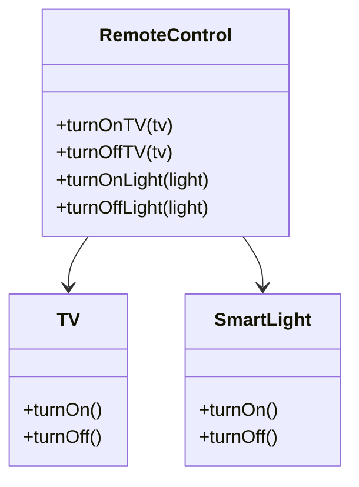
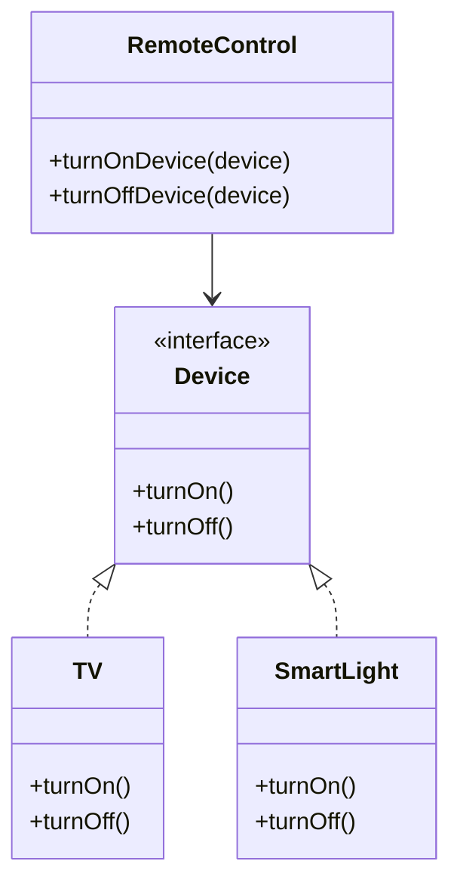

Violates DIP

```mermaid
classDiagram
    class RemoteControl {
        +turnOnTV(tv)
        +turnOffTV(tv)
        +turnOnLight(light)
        +turnOffLight(light)
    }

    class TV {
        +turnOn()
        +turnOff()
    }

    class SmartLight {
        +turnOn()
        +turnOff()
    }

    RemoteControl --> TV
    RemoteControl --> SmartLight

```

Applies DIP

```mermaid
classDiagram
    class Device {
        <<interface>>
        +turnOn()
        +turnOff()
    }

    class TV {
        +turnOn()
        +turnOff()
    }

    class SmartLight {
        +turnOn()
        +turnOff()
    }

    class RemoteControl {
        +turnOnDevice(device)
        +turnOffDevice(device)
    }

    Device <|.. TV
    Device <|.. SmartLight
    RemoteControl --> Device

```