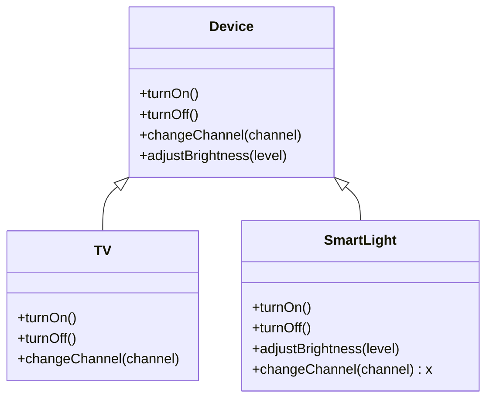
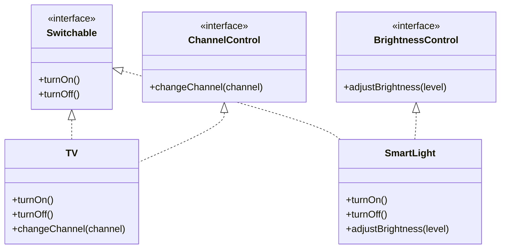

Violates ISP

```mermaid
classDiagram
    class Device {
        +turnOn()
        +turnOff()
        +changeChannel(channel)
        +adjustBrightness(level)
    }

    class TV {
        +turnOn()
        +turnOff()
        +changeChannel(channel)
    }

    class SmartLight {
        +turnOn()
        +turnOff()
        +adjustBrightness(level)
        +changeChannel(channel) x
    }

    Device <|-- TV
    Device <|-- SmartLight

```

Applies ISP

```mermaid
classDiagram
    class Switchable {
        <<interface>>
        +turnOn()
        +turnOff()
    }

    class ChannelControl {
        <<interface>>
        +changeChannel(channel)
    }

    class BrightnessControl {
        <<interface>>
        +adjustBrightness(level)
    }

    class TV {
        +turnOn()
        +turnOff()
        +changeChannel(channel)
    }

    class SmartLight {
        +turnOn()
        +turnOff()
        +adjustBrightness(level)
    }

    Switchable <|.. TV
    ChannelControl <|.. TV
    Switchable <|.. SmartLight
    BrightnessControl <|.. SmartLight

```