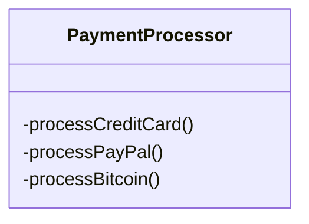
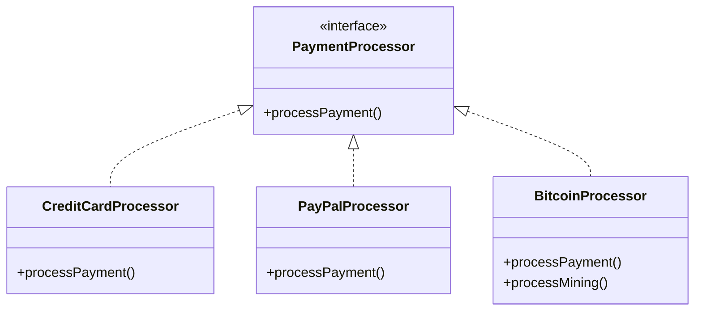

Violates OCP

```mermaid
classDiagram
    class PaymentProcessor {
        -processCreditCard()
        -processPayPal()
        -processBitcoin()
    }

```

Applies OCP

```mermaid
classDiagram
    class PaymentProcessor {
        <<interface>>
        +processPayment()
    }

    class CreditCardProcessor {
        +processPayment()
    }

    class PayPalProcessor {
        +processPayment()
    }

    class BitcoinProcessor {
        +processPayment()
        +processMining()
    }

    PaymentProcessor <|.. CreditCardProcessor
    PaymentProcessor <|.. PayPalProcessor
    PaymentProcessor <|.. BitcoinProcessor

```