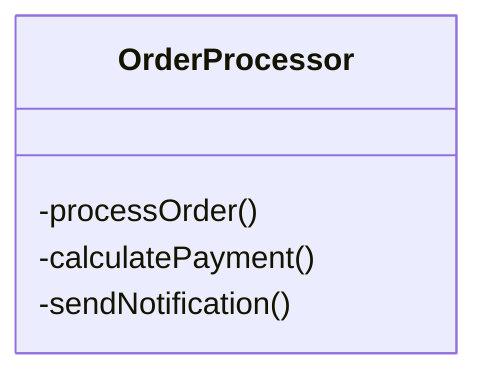
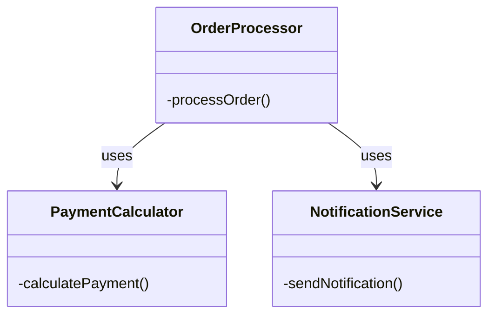

Violates SRP

```mermaid
classDiagram
    class OrderProcessor {
        -processOrder()
        -calculatePayment()
        -sendNotification()
    }
```

Applies SRP

```mermaid
classDiagram
    class OrderProcessor {
        -processOrder()
    }
    class PaymentCalculator {
        -calculatePayment()
    }
    class NotificationService {
        -sendNotification()
    }

    OrderProcessor --> PaymentCalculator : uses
    OrderProcessor --> NotificationService : uses

```